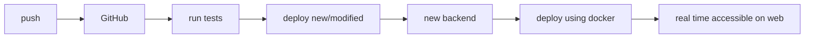
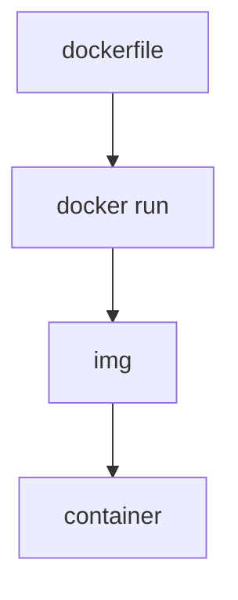
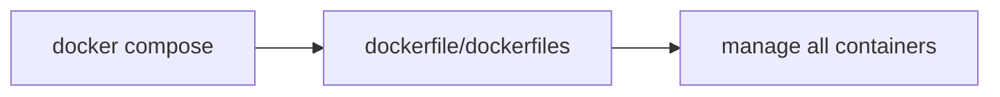
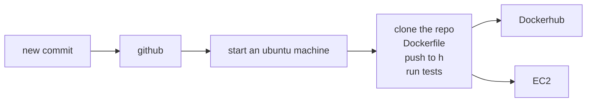
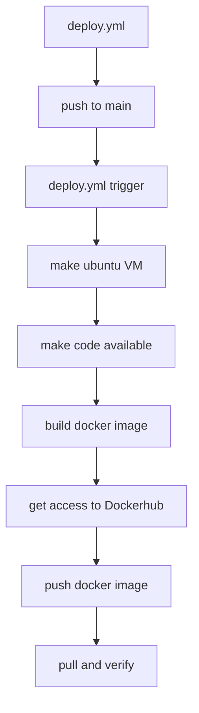
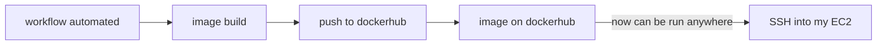

# Docker and CI/CD Pipeline Learning Notes

## 1. Basic Development Flow


## 2. Docker Basics

### Dockerfile
1. Steps to make a Docker image:
   - Build a simple Docker image
   - Configure for one container
   - Use docker build, docker run commands



### Docker Compose
1. Key Features:
   - Manage multiple containers as a cohesive app
   - Container management
   - Docker compose up/down commands



## 3. CI/CD Pipeline

### Continuous Integration (CI)
- Each integration is verified by building the project and running automated tests
- Ensures code quality and integration compatibility

### Continuous Deployment (CD)
- Code changes are deployed to target environment once they pass CI process
- Automated deployment pipeline



## 4. Workflow Details

### GitHub Actions Workflow
```yaml
name: workflow
on: push
jobs:
  build:
    runs-on: ubuntu-latest
```

### Docker Configuration
```dockerfile
FROM: <an official docker node image>
WORKDIR
COPY ...
RUN npm install
RUN npm build
CMD -> npm run start server app
```

### Deployment Process


## 5. Docker Image Management

### Image Push/Pull Process
- Docker push uses tag and image name to determine which image to push to registry
- Images can be run anywhere once in Dockerhub



## 6. Security Considerations
- Docker Hub username and password stored in GitHub Actions secrets
- Secure authentication flow for image pulls
- SSH access to EC2 instances
- Proper secret management in GitHub Actions

## 7. Key Commands
```bash
# Docker Commands
docker build
docker run
docker push

# NPM Commands
npm install
npm build
npm run start

# Docker Compose
docker-compose up
docker-compose down
```

## 8. Best Practices
1. Always use official base images
2. Implement proper security measures
3. Use Docker Compose for multi-container applications
4. Maintain CI/CD pipeline automation
5. Regular testing and verification
6. Proper secret management
7. Version control for Docker images

## 9. Workflow Summary
1. Code push triggers GitHub Actions
2. Automated testing in Ubuntu VM
3. Docker image build and push
4. Deployment to production environment
5. Continuous monitoring and verification